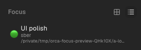
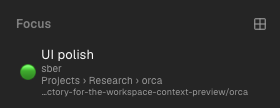
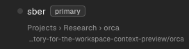

# Personal Focus fork

This is the personal `aleradev12/orca` fork. Product changes are proposed and merged
inside this fork, not offered as upstream PRs. The MIT license and upstream notices
remain intact.

## Branches and change history

- `main` is the unmodified upstream mirror as of fork creation.
- `focus/main` is the default integration branch, starting at Orca **1.4.205**,
  commit `28a2b628bc8718ff571baa738085e3fed408af4e`.
- Every change has an issue, a descriptive topic branch, a linked PR and a merge
  commit. Do not rewrite the published integration history.
- Use conventional commit subjects, plain-language PR summaries, concrete test
  results and explicit platform/remote/security limitations.

| Change | Issue | Merged PR |
| --- | --- | --- |
| Distribution identity/profile/CLI/update isolation | [#1](https://github.com/aleradev12/orca/issues/1) | [#10](https://github.com/aleradev12/orca/pull/10) |
| Native Focus shortcuts, ordering and unread indicator | [#2](https://github.com/aleradev12/orca/issues/2) | [#11](https://github.com/aleradev12/orca/pull/11) |
| Projects collapse | [#3](https://github.com/aleradev12/orca/issues/3) | [#12](https://github.com/aleradev12/orca/pull/12) |
| Globally ranked Projects search | [#4](https://github.com/aleradev12/orca/issues/4) | [#13](https://github.com/aleradev12/orca/pull/13) |
| Disposable E2E Keychain diagnostic | [#5](https://github.com/aleradev12/orca/issues/5) | [#14](https://github.com/aleradev12/orca/pull/14) |
| Shared workspace ancestry/path context | [#6](https://github.com/aleradev12/orca/issues/6) | [#15](https://github.com/aleradev12/orca/pull/15) |
| One Focus view switch | [#7](https://github.com/aleradev12/orca/issues/7) | [#16](https://github.com/aleradev12/orca/pull/16) |
| Bounded drag autoscroll | [#8](https://github.com/aleradev12/orca/issues/8) | [#17](https://github.com/aleradev12/orca/pull/17) |
| Independent development profiles | [#18](https://github.com/aleradev12/orca/issues/18) | [#19](https://github.com/aleradev12/orca/pull/19) |

Additional fixes: [#23](https://github.com/aleradev12/orca/pull/23) / issue #22
uses a themed popover surface for rich Focus hints (content and arrow adapt live;
default label tooltips remain unchanged). Issue #24 adds Focus's Mark Unread /
Mark Read command, sharing the existing Projects metadata action.

## Visible behavior

Focus list items show the custom label followed by **branch, group ancestry/project,
workspace path**. Grid items stay compact and expose the same context in their
tooltip. The single header button shows the next view and switches grid/list.

Projects search shows **only branch rows**, globally ranked, with group
ancestry/project and workspace path below the existing title. Passive group/repo
headers, folder rows, inboxes and creation placeholders are omitted only during
search. Clearing the query restores the ordinary layout.

Paths truncate at the **start**, preserving their suffix. Full paths/group chains
remain available through titles. Local Git refs display without `refs/heads/`.
Group names participate in project-context search. Focus's amber unread marker
uses `worktree.isUnread`, exactly as Projects' bell; it is not a terminal activity
indicator. Focus's context menu now exposes **Mark Unread / Mark Read**, as
Projects already does. The state persists and is shared across both panels;
normal activation clears it. Unavailable/archived targets cannot be marked.

Dragging uses a fixed overlay outside the scrollable list. The placeholder does
not translate, preventing an expanding scrollHeight/autoscroll feedback loop.

## Before / after

These are actual Electron screenshots of disposable synthetic repositories under
`/private/tmp`, not user profiles, private histories or renderer-store mockups.

| Focus | Projects search |
| --- | --- |
| Before:  | Before:  |
| After:  | After:  |

## Development and validation

The fork preserves upstream's source tooling. Use Node/pnpm versions specified by
`package.json` and the upstream install policy. `pnpm dev` uses an independent
`orca-focus-dev` profile, not the packaged primary's `orca-focus` profile. An
explicit `ORCA_DEV_USER_DATA_PATH` overrides only development userData. Do not
point it at a working app's profile.

Current validation: macOS arm64 web/node typechecks, **67 focused Vitest tests**,
signed local package and real Electron IPC/UI smoke. The smoke verifies nested
group context, group-name search, two search context rows, three Focus context
rows, visible suffix geometry on an actually overflowing path, view switching
and restart persistence, pointer/keyboard reordering, cancellation and bounded
scrollHeight while holding a drag at the bottom edge, live dark/light tooltip
surface/arrow colors, and persisted manual read/unread commands from both menus.
Host-qualified metadata calls and unavailable targets also have focused unit tests.

The complete upstream test suite, physical Windows/Linux UI, real SSH latency and
large-catalog performance have **not** been validated. Inherited GitHub workflows
have not been activated as a fork-specific release/validation pipeline. Do not
interpret a merged internal PR as a claim of full upstream CI coverage.

## Upstream updates

Use the original repository as `upstream` and this fork as `origin`. If using the
existing shallow checkout, unshallow it before reconciling older ancestry:

```sh
git fetch --unshallow upstream   # only when git reports a shallow repository
git fetch upstream --tags
git fetch origin
git switch -c chore/sync-upstream-vX.Y.Z origin/focus/main
git merge vX.Y.Z
```

Create an issue for the update, resolve conflicts, validate with the corresponding
native runtime/dependencies, open a PR into `focus/main`, and merge it. Do not
force-push or rebase the published integration branch. The separate `main` mirror
can be advanced with a fast-forward-only merge from `upstream/main`.

**Packaging is not yet ready for arbitrary new upstream versions.** The existing
local sidecar assembler uses the exact installed 1.4.205 native runtime and rejects
unrelated runtime/dependency changes. It is local delivery tooling, not the
standalone source release workflow. Native independent packaging and fork CI are
tracked in [#9](https://github.com/aleradev12/orca/issues/9). Do not install an
upstream-branded build over the original Orca or reuse 1.4.205 native binaries with
newer core code. No automatic session migration is part of updates.
